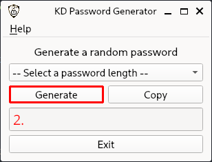

# KD Password Generator

### Description:

The KD Password Generator is a simple desktop application to generate a random password between 8 and 20 characters.

Developed with Python and PyQt6.

### How to run:

#### Using the "<> Code" button and download the zip file from GitHub

```bash
cd KDPasswordGenerator
```

```bash
python3 -m venv ./env
```

#### On Windows

```bash
. ./env/Scripts/activate
```

#### On Linux and Mac OS

```bash
. ./env/bin/activate
```

```bash
pip install -r requirements.txt
```

```bash
python3 main.py
```

#### Clone the repository on your local mashine

```bash
git clone https://github.com/KarnesTH/KDPasswordGenerator.git
```

```bash
cd KDPasswordGenerator
```

```bash
python3 -m venv ./env
```

#### On Windows

```bash
. ./env/Scripts/activate
```

#### On Linux and MacOS

```bash
. ./env/bin/activate
```

```bash
pip install -r requirements.txt
```

```bash
python3 main.py
```

### How to use:

1. Select a number in the dropdown menu for your password length


2. Click the "Generate" button to generate your password



3. Click the "Copy" button to copy your generated password to your clipbord


